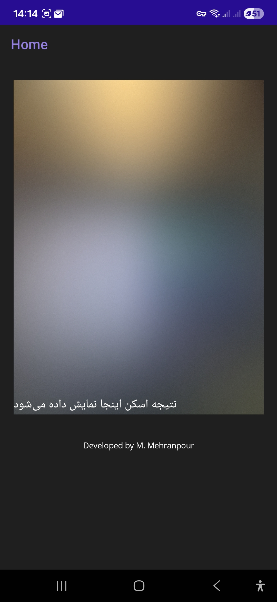
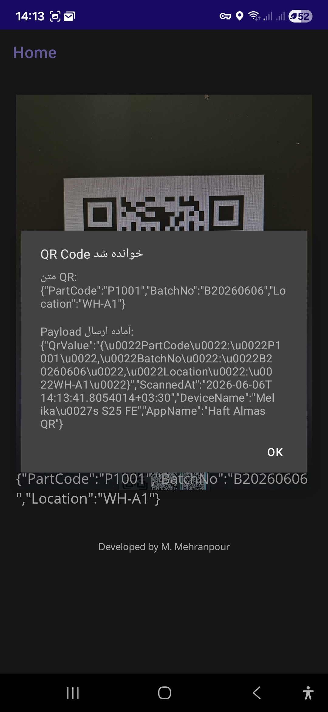
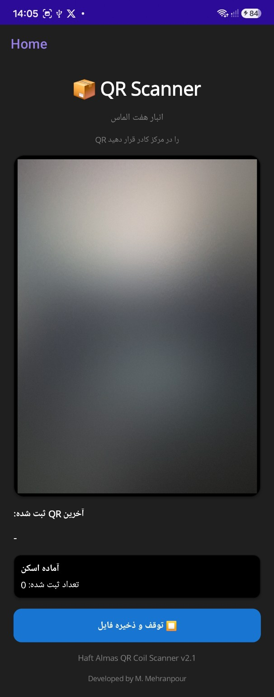
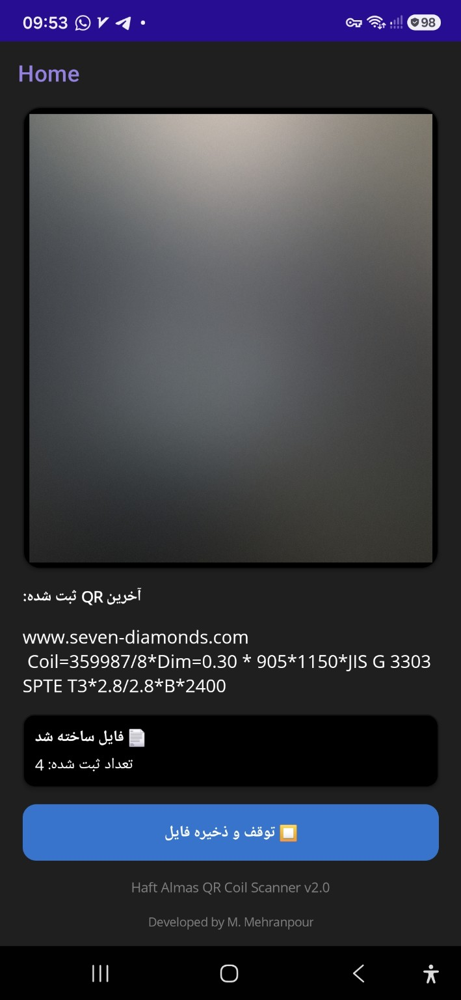
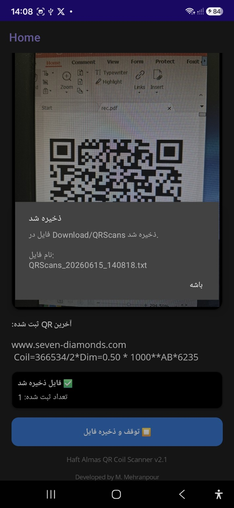
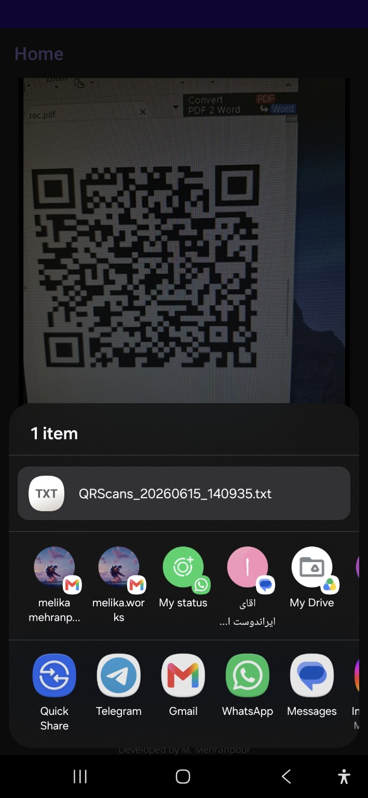
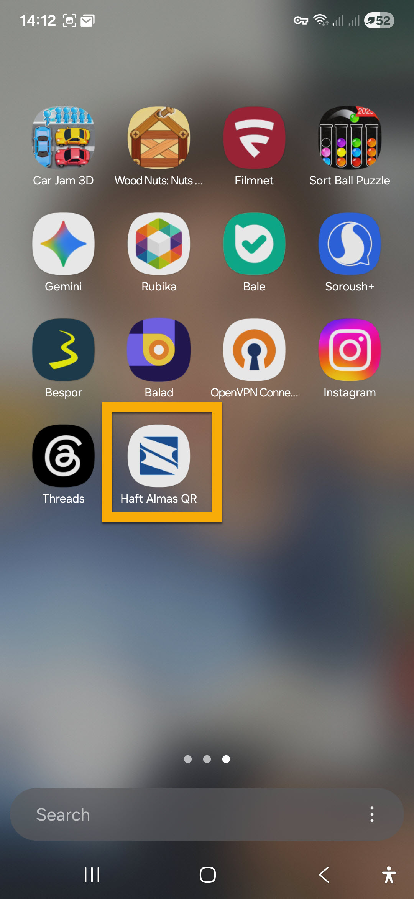

# QRCodeScanner-MAUI


A cross-platform QR Code Scanner built with .NET MAUI.

This project was initially developed as a web-based Proof of Concept (PoC) to validate QR processing workflows and inventory data structures. After successful validation, it evolved into an Android application for real-time QR scanning and was later enhanced to support actual warehouse operations at Haft Almas.

---

## Project Overview

The application scans QR codes using the device camera and generates structured outputs that can be consumed by inventory, warehouse, or ERP systems.

### Current capabilities

- Real-time QR code scanning
- Continuous scanning mode
- Android camera integration
- Display of the latest scanned QR value
- Scan counter
- Export scanned results to TXT files
- Automatic file creation in the Downloads folder
- Share generated scan files using Android Share Sheet
- Tested on physical Android devices
- Duplicate QR code prevention
- Android 9 and below file storage support
- Persian font support (Vazirmatn)

### Future Enhancements

- ERP Integration
- Warehouse Management System (WMS) Integration
- REST API Connectivity
- Authentication & Authorization
- Online Synchronization

---

## Technology Stack

- .NET MAUI
- C#
- Android
- ZXing.Net.Maui

---

## Project Evolution

### Phase 1 – Web Prototype

A web-based prototype was developed to:

- Validate the QR workflow
- Test payload structures
- Verify inventory-related data models

Early version capabilities included:

- Single QR processing
- JSON payload generation
- Workflow validation

<p align="center">
  
  
</p>

---

### Phase 2 – Initial Mobile Application

The project was migrated to .NET MAUI to:

- Enable camera-based QR scanning
- Support Android deployment
- Improve usability in warehouse environments
- Validate functionality on physical devices

---

### Phase 3 – Haft Almas QR Coil Scanner (Current Version)

The application was enhanced to support actual warehouse workflows.

Current features include:

- Continuous QR scanning
- Coil QR data processing
- Display of the latest scanned QR value
- Real-time scan counter
- Export scan results to TXT files
- Automatic file generation in the Downloads folder
- Share generated files through Android Share Sheet
- Real device testing in operational scenarios

<p align="center">
  
  
</p>

<p align="center">
  
  
</p>

The application allows operators to export scanned QR results into timestamped TXT files and instantly share them using Android's native Share Sheet.
---

## Application Installed

<p align="center">
  
</p>

---

## Sample QR Payload

```json
{
  "PartCode": "P1001",
  "BatchNo": "B20260606",
  "Location": "WH-A1"
}
```

Sample files are available in:

```text
samples/
```

---

## Running the Project

1. Clone the repository

```bash
git clone https://github.com/MelikaWorks/QRCodeScanner-MAUI.git
```

2. Open the solution in Visual Studio 2022

3. Restore NuGet packages

4. Connect an Android device or start an emulator

5. Build and run the application

Additional documentation can be found in:

```text
docs/
```

---

## Security Notice

This repository contains only the public demonstration version of the project.

The following items are intentionally excluded:

- ERP/WMS Integration Details
- API Endpoints
- Authentication Credentials
- Database Connections
- Internal Business Logic
- Production Configuration

All sample data included in this repository is fictional and used only for demonstration purposes.

---

## Current Status

```text
Haft Almas QR Coil Scanner v2.2
Status: Active
Deployment: Android
Technology: .NET MAUI
```

---

## Author

👩‍💻 **Melika Mehranpour**

Senior Software Engineer | Full Stack .NET Developer | Enterprise Applications

### Technologies

C# • .NET • ASP.NET Core • SQL Server • PostgreSQL • Power BI • Python • .NET MAUI

### Connect with me

🔗 [LinkedIn](https://www.linkedin.com/in/melika-mehranpour-41b627161/)
🔗 [GitHub](https://github.com/MelikaWorks)
  
---

## License

See the [LICENSE](LICENSE) file for license information.
